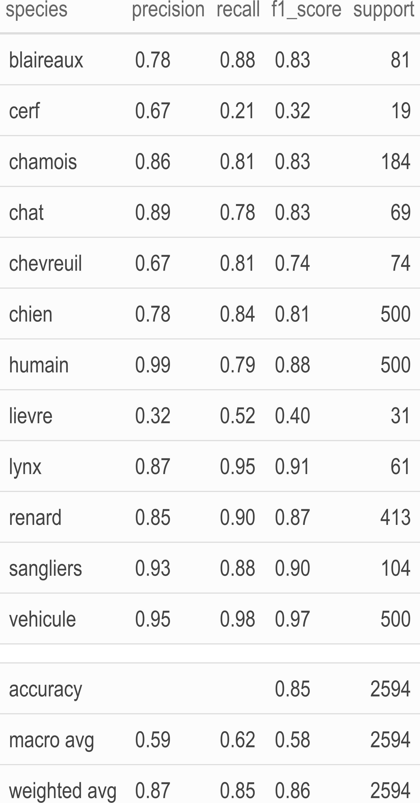
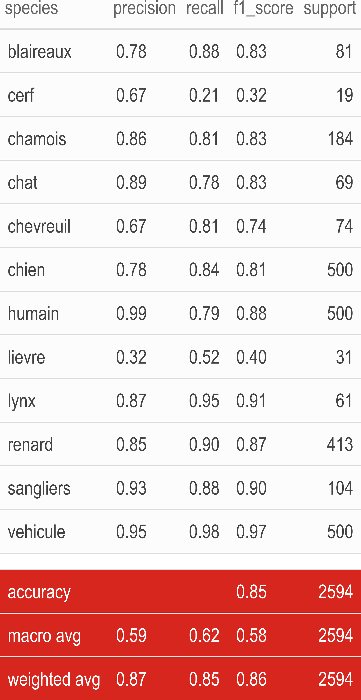
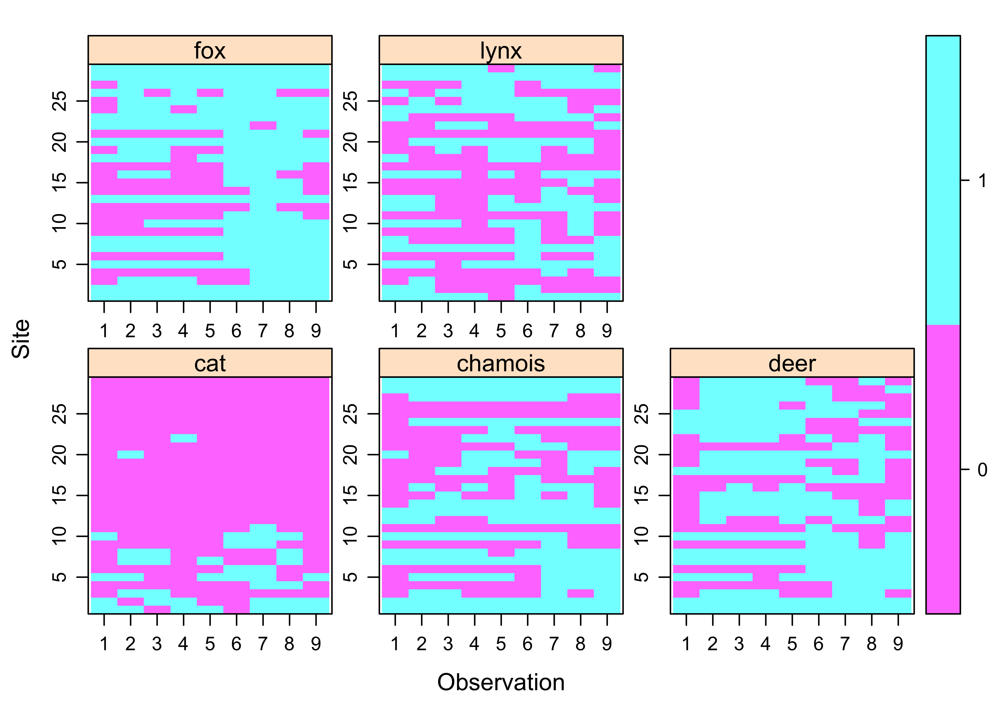

class: center, middle
background-image: url(img/illustration1bis.jpg)
background-size: cover 
<br>
### Deep learning, false negatives/positives and predator-prey interactions: Peregrinations in `R`

.large[Olivier Gimenez [`r icon::fa_twitter()`](https://twitter.com/oaggimenez) [`r icon::fa_github()`](https://github.com/oliviergimenez) | Journée IA & Biodiversité NUMEV-Cemeb [`r icon::fa("home")`](https://www.labex-cemeb.org/en/node/4374)] 

.footnote[
`r icon::fa("camera")` Alain Laurent & David Hackel]

```{r setup, include=FALSE}
options(htmltools.dir.version = FALSE)
library(tidyverse)
library(kableExtra)
```

```{r xaringan-themer, include=FALSE, warning=FALSE}
library(xaringanthemer)
style_duo(primary_color = "#1F4257", secondary_color = "#F97B64")
```

???

* Bonjour. Mon nom est Olivier Gimenez. Je suis chercheur CNRS au Centre d'Ecologie Fonctionnelle et Evolutive Montpellier. 

* Je vais vous parler de mes premiers pas dans le deep learning avec le logiciel R, et son application à la reconnaissance d'espèces sur des photos prises grâce à des pièges photographiques. 


---
class: inverse, left, top
background-image: url(img/grabbytheballs.jpg)
background-size: cover 

## Predator-prey interactions

.footnote[
`r icon::fa("camera")`[Sarah Skinner](https://www.comedywildlifephoto.com/gallery/finalists/2019_finalists.php)]


???

* Je travaille beaucoup sur les relations prédateur-proies, des interactions entre espèces qui façonnent les communautés de grands mammifères. 

* La ppale question que l'on se pose est de comprendre comment l'environnement et les relations entre prédateurs et proies s'articulent. 


---
class: left, middle
background-image: url(img/juramountains.jpg)
background-size: cover 

<br><br><br><br><br><br><br><br><br><br>

<li>Coll. A. Chaine, M. Kervellec, V. Mielle, [OFB](https://ofb.gouv.fr/) and Ain/Jura hunting associations
<li>Precious help from folks at [Montpellier Bioinformatics and Biodiversity (MBB)](https://mbb.univ-montp2.fr/MBB/index.php)
<li>How do environmental factors affect lynx and its preys ?

.footnote[
`r icon::fa("camera")` [Peter Bucks](https://twitter.com/peterbucks)]

???

* Il s'agit d'un travail en collaboration avec Anna Chaine, Maëlis Kervellec, toutes deux stagiaires de Master, Vincent Miele, les collègues de l'Office Français de la Biodiversité et des fédérations de chasse de l'Ain et du Jura.  

* J'en profite pour remercier les collègues de la PF MBB qui ont été d'une aide précieuse pour l'utilisation des machines GPU.

---
class: left, middle
background-image: url(img/cameratraps.jpg)
background-size: cover 

<br><br><br>

## Camera traps

.footnote[
`r icon::fa("camera")` [Tiard Schulz](https://tiard-schulz-fotografie.jimdosite.com/)]


???

* Les collègues de l'OFB et des fédérations de chasse collectent des données dans l'habitat naturel des espèces qui nous intéressent, grâce à des pièges photos laissés à des endroits stratégiques. 

* Alors pas avec du matériel comme celui-ci qui disparaitrait bien vite. 

---
class: left, top
background-image: url(img/lynx_kittens.JPG)
background-size: cover

???

* Mais plutôt ce genre de piège photo. 

* Avec un système où l'on installe un appareil de chaque côté de chemins où les prédateurs sont susceptibles de passer, comme ici une femelle et ses petits.  

* Cette méthode est non-invasive, autrement dit on n'a pas besoin de capturer physiquement les animaux. Le souci est qu'on se retrouve avec des tonnes de photos auxquelles il faut associer une étiquette espèce. C'est là qu'entre en jeu le deep learning. 


--

* Non-invasive monitoring

--

* Gigas of pix to tag by hand

--

* Deep learning?

---
class: center, middle
background-image: url(https://miro.medium.com/max/3840/1*oB3S5yHHhvougJkPXuc8og.gif)
background-size: contain 
<!-- * Je suis curieux. J'aime comprendre. J'aime bcp R.  -->

.footnote[
Source: [Andrew Ng](https://en.wikipedia.org/wiki/Andrew_Ng)]


???

L'idée est de nourrir les algorithmes avec des photos et en sortie de récupérer l'espèce qui se trouve sur la photo. 


---
class: center, top
background-image: url(img/imaginecology.png)
background-size: contain 
## <https://ecostat.gitlab.io/imaginecology/>

<br><br><br><br><br><br><br><br><br><br><br><br><br>

#### Kuddos to [Vincent Miele](https://lbbe.univ-lyon1.fr/-Miele-Vincent-.html) and [Gaspard Dussert](https://www.linkedin.com/in/gaspard-dussert/?originalSubdomain=fr) !


???

* Pour faire mes premiers pas en DL, j'ai utilisé imaginecology proposé par le GDR Ecologie Statistique. 

* Sérieusement, jetez-y un coup d'oeil. C'est bourré de ressources précieuses et pertinentes. Il y une intro au DL, des codes, des papiers, des données pour entrainer vos modèles. Et surtout tout un tas de tutoriels pour vous former. 

* Bravo à Vincent et Gaspard pour ce boulot! 

Mentionner que c'est le boulot du GdR EcoStat. ON a fait des journées déjà. Je vous envois sur les cours de Vincent en particulier. 


---
class: center, top
background-image: url(img/imagine_conf.png)
background-size: contain 

<br><br><br>

### <https://imaginecology.sciencesconf.org/>


???

* Toujours avec le GDR EcoStat, nous avons organisé en novembre des rencontres autour de l'utilisation des méthodes d'apprentissage profond pour l'analyse d'image et de son en écologie.

* A cette occasion, Vincent Miele a donné un exposé introductif filmé dans lequel il donne les concepts généraux, les réseaux de neurones et le vocabulaire technique. 


---
class: right, top
background-image: url(img/illustration1.jpg)
background-size: cover 

.footnote[
`r icon::fa("camera")` [Sylvain Gatti](https://www.linkedin.com/in/sylvaingatti/?locale=fr_FR)]

???

Pour mes analyses, j'ai utilisé blabla. 


--

I used the [Python/PyTorch fastai deep learning library](https://github.com/fastai/fastai)

--

It comes with an [`R` interface](https://eagerai.github.io/fastai/) that provides `R` wrappers to fastai.

```{r, out.width="50%", echo = FALSE}
knitr::include_graphics("img/fastai.png")
```

<!-- RetinaNet is a single-stage object detector : for each known object on an image it can predict a class, a bounding box (a square containing the object) and a confidence score. -->

???

+ fastai is a deep learning library which provides practitioners with high-level components that can quickly and easily provide state-of-the-art results in standard deep learning domains, and provides researchers with low-level components that can be mixed and matched to build new approaches. It aims to do both things without substantial compromises in ease of use, flexibility, or performance. This is possible thanks to a carefully layered architecture, which expresses common underlying patterns of many deep learning and data processing techniques in terms of decoupled abstractions. These abstractions can be expressed concisely and clearly by leveraging the dynamism of the underlying Python language and the flexibility of the PyTorch library

+ The fastai library simplifies training fast and accurate neural nets using modern best practices. See the fastai website to get started. The library is based on research into deep learning best practices undertaken at fast.ai, and includes “out of the box” support for vision, text, tabular, and collab (collaborative filtering) models.

<!-- --- -->
<!-- class: left, top -->
<!-- background-image: url(https://thumbs.gfycat.com/FreeThoughtfulJumpingbean-size_restricted.gif) -->
<!-- background-size: cover  -->

<!-- ??? -->

<!-- Avant de passer aux résultats, je rappelle que je suis débutant. Je me forme avec l'aide de Vincent qui n'est toutefois pas responsables de mes errements.  -->


---
class: inverse, right, top
background-image: url(https://blog.nationalgeographic.org/wp-content/uploads/2013/08/01-Snapshot-originals-3-Slide61.gif)
background-size: cover 

## Results?


???

Quels sont les résultats?

---
class: inverse, center, middle

## Transfer learning on a site (Jura)

???

Dans un premier temps, j'ai fait du transfer learning sur un site d'étude dans le Jura où on avait tout un tas de photos déjà étiquetées. 

---
## Some `R` code

Load the `fastai` library:
```{r eval = FALSE}
library(fastai)
```

---
## Some `R` code

Load and apply transformations on training/validation pictures:
```{r eval = FALSE}
dls <- ImageDataLoaders_from_folder(
  path = "pixdir/pix/",
  train = "train",
  valid = "valid",
  item_tfms = Resize(size = 460), # resize pix
  batch_tfms = list(aug_transforms(size = 224, 
                                   min_scale = 0.75), # flip, rotate, 
                                                      # zoom, warp, 
                                                      # light transf.
                    Normalize_from_stats( imagenet_stats() )))
```

---
## Some `R` code

Get the model architecture, a resnet50:
```{r eval = FALSE}
learn <- cnn_learner(dls = dls, 
                     arch = resnet50(), 
                     metrics = list(accuracy, error_rate))
```

---
## Some `R` code

Train using CPU or GPU:
```{r eval = FALSE}
one_cycle <- learn %>% 
  fit_one_cycle(n_epoch = 20, 
                cbs = SaveModelCallback(every_epoch = TRUE, 
                                        fname = 'model'))
one_cycle
```

???

We used with 20 epochs, and saved the models after each epoch for later use.

---
class: center, middle
background-image: url(img/lynxplusprey.png)
background-size: contain 


???

Les résultats sont plutôt bons. On arrive à détecter sur les images et classifier le lynx, et ses proies, le chamoix et le chevreuil, avec un degré de certitude élevé.

---
class: center, middle
background-image: url(img/others.png)
background-size: contain 


???

C'est le cas aussi pour d'autres espèces présentes sur les photos. 


---
class: center, middle
background-color: white


```{r echo=FALSE, message=FALSE, warning=FALSE}
options(knitr.kable.NA = '')
readr::read_csv2(here::here("dat","perf_fastai.csv")) %>% 
  janitor::clean_names() %>%
  kbl() %>%
  kable_paper() %>%
  kable_styling(full_width = F, font_size = 20) %>%
  row_spec(13, bold = T, color = "white", background = "white") %>%
  row_spec(14:16, bold = T) %>%
  column_spec(1, bold = TRUE) %>%
  save_kable(here::here("img", "perf1.png"),
             zoom = 5)
```

<!-- {width=80%, height=80%} -->



???

Four metrics are given.

+ Precision is the ratio tp / (tp + fp) where tp is the number of true positives and fp the number of false positives. It quantifies the ability of the classifier not to label as positive a sample that is negative. The question that this metric answers is of all pix that labeled as positive, how many actually were positive?

+ The recall is the ratio tp / (tp + fn) where tp is the number of true positives and fn the number of false negatives. The recall is intuitively the ability of the classifier to find all the positive samples. The question recall answers is: of all the pix that were positive, how many did we label?

+ The f1-score can be interpreted as a weighted average of the precision and recall, it reaches its best value at 1 and worst score at 0. The f1-score weights recall more than precision by a factor of 1, meaning that recall and precision are equally important. f1-score is 2 * (recall * precision) / (recall + precision)

+ The support is the number of occurrences of each class in y_true (ground truth or correct target values).


---
class: center, middle
background-color: white


```{r echo=FALSE, message=FALSE, warning=FALSE}
options(knitr.kable.NA = '')
readr::read_csv2(here::here("dat","perf_fastai.csv")) %>% 
  janitor::clean_names() %>%
  kbl() %>%
  kable_paper() %>%
  kable_styling(full_width = F, font_size = 20) %>%
  row_spec(13:16, bold = T, color = "white", background = "#D7261E") %>%
  row_spec(13, bold = T, color = "white", background = "white") %>%
  row_spec(14:16, bold = T) %>%
  column_spec(1, bold = TRUE) %>%
  save_kable(here::here("img", "perf2.png"),
             zoom = 5)
```

<!-- {width=80%, height=80%} -->



???

+ macro avg: Calculate metrics for each label, and find their unweighted mean. This does not take label imbalance into account.

+ weighted avg: Calculate metrics for each label, and find their average weighted by support (the number of true instances for each label). This alters ‘macro’ to account for label imbalance.

+ Accuracy is the most intuitive performance measure and it is simply a ratio of correctly predicted observation to the total observations, it is (tp + tn)/(tp + tn + fp + fn)


---
class: center, middle
background-color: white


```{r echo=FALSE, message=FALSE, warning=FALSE}
options(knitr.kable.NA = '')
readr::read_csv2(here::here("dat","perf_fastai.csv")) %>% 
  janitor::clean_names() %>%
  kbl() %>%
  kable_paper() %>%
  kable_styling(full_width = F, font_size = 20) %>%
  row_spec(c(3,5,9), bold = T, color = "white", background = "#D7261E") %>%
  row_spec(13, bold = T, color = "white", background = "white") %>%
  row_spec(14:16, bold = T) %>%
  column_spec(1, bold = TRUE) %>%
  save_kable(here::here("img", "perf.png"),
             zoom = 5)
```

<!-- {width=80%, height=80%} -->


???

Pour les 3 espèces d'intérêt. 

---
class: inverse, center, middle

## Automatic tagging in another site (Ain)


???

Ensuite, j'ai voulu utilisé mon modèle pour étiqueter automatiquement des photos prises avec des pièges installés sur un autre site, dans l'Ain. Ces photos ont aussi été étiquetées à la main. Ground truth. 


---
## Some `R` code

Tag pictures based on the model we trained:
```{r eval = FALSE}
learn %>% 
  predict(pix_to_be_tagged)
```


---
class: middle, center
background-image: url(img/blackboard.jpg)
background-size: cover 

```{r echo = FALSE, message = FALSE, warning = FALSE}
load(here::here("dat/", "pixAinannot.RData"))
library(highcharter)
dout <- unclass(table(tt_final$observed,tt_final$predicted))
perf_prediction <- hchart(dout, label = TRUE) %>%
    hc_yAxis(title = list(text = 'Actual')) %>%
    hc_xAxis(title = list(text = 'Predicted'),
             labels = list(rotation = -90)) %>%
    hc_add_theme(hc_theme_chalk())
perf_prediction
```

???

+ Let's focus on the 3 species we're interested in, and dissect the false negatives and positives. A false negative is for example a picture in which we have a lynx, and it is predicted otherwise. A false positive is for example a picture in which we do not have a lynx, but it is predicted that we have one.

+ Starting with the false negatives (check out the rows of the table):
    + lynx get falsely predicted as chat and renard above all;
    + chamois get predicted as chevreuil sometimes;
    + chevreuil get detected as chamois, chien and renard.

+ Lynx get sometimes detected as chamois, chamois as chevreuil, chevreuil as chamois and lynx (lots of chevreuil pictures).

+ And the false positives (check out the columns of the table):
    + chamois are falsely predicted as such when they are actually a bunch of other things, and chevreuil and humain above all;
    + chevreuil are falsely predicted as such when they are actually cerf, humain, renard or vache (!);
    + lynx are falsely predicted as such when they are actually chevreuil, vache (!), humain and renard.


---
class: center, middle
background-image: url(https://media.giphy.com/media/j4rPM934CLIvC/giphy.gif)
background-size: cover 

???

C'est pas jojo. Il y a un peu de frustration, il ne faut pas le cacher... Mais passé cette frustration, on s'est posé la question, est-ce bien grave par rapport à la question écologique?


---
background-color: white

```{r echo = FALSE}
knitr::include_graphics("img/rota_cover.png")
```

---

## Some `R` code

Load `unmarked` to fit SDMs w/ interactions and imperfect detection:
```{r eval = FALSE}
load(unmarked)
```

---
background-color: white

```{r echo = FALSE}

```


---
## Some `R` code

Fit a model w/ interactions bw lynx, roe deer and chamois, w/ cats and fox too:
```{r eval = FALSE}
# Marginal and interaction effects
occFormulas <- c('~1','~1','~1','~1','~1','~1','~1','~0',...,'~0') 
# Detection probabilities
detFormulas <- c('~1','~1','~1','~1','~1')
fit <- occuMulti(detformulas = detFormulas,
                 stateformulas = occFormulas,
                 data = data,
                 method = "Nelder-Mead")
fit
```


---
class: inverse, center
background-color: white
### Marginal occupancy

```{r echo = FALSE, out.width = "85%"}
knitr::include_graphics("img/marginal_occ.png")
```


---
class: inverse, center
background-color: white
### Conditional occupancy

```{r echo = FALSE}
knitr::include_graphics("img/conditional_occ.png")
```


---
class: left, top
background-image: url(https://media.giphy.com/media/3o7btPCcdNniyf0ArS/giphy.gif)
background-size: cover

# Conclusions

--
+ Generalisation to another site is challenging.

--
+ Lack of diversity in training dataset? More pix to come.

--
+ Do not lose sight of the ecological question.

--
+ Ongoing work: Account for both false negatives and false positives. 

???

+ On sait par exemple que généraliser un modèle entrainé sur un site à un autre site est difficile en DL. Les pièges, les conditions environnementales, le terrain, l'exposition, des tas de choses peuvent être différentes.  
+ Il se peut aussi que le jeu de données d'entrainement soit trop pauvre.  
Ce que je compte faire maintenant, sur le conseil de Vincent, c'est utiliser les données des deux sites pour entrainer mon modèle. 


<!-- --- -->
<!-- class: inverse, center, middle -->
<!-- # Lessons learned -->

<!-- ??? -->

<!-- Je finirai cet exposé en donnant quelques leçons que j'ai tirées en cours de chemin, vous en faites ce que vous voulez. -->

<!-- --- -->

<!-- .pull-left[ -->

<!-- ### Terminology is tricky -->


<!-- ] -->

<!-- .pull-right[ -->
<!-- ] -->

<!-- ??? -->

<!-- La terminologie peut être un obstable. Sur imaginecology, vous trouverez un glossaire qui vous sauvera. Le point de vue d'une statisticienne peut aussi être utile pour faire le // avec un vocabulaire plus familier.   -->

<!-- --- -->

<!-- .pull-left[ -->

<!-- ### Terminology is tricky -->

<!-- * [imaginecology](https://ecostat.gitlab.io/imaginecology/basics.html) glossary  -->


<!-- ] -->

<!-- .pull-right[ -->
<!--  -->
<!-- ] -->

<!-- --- -->

<!-- .pull-left[ -->

<!-- ### Terminology is tricky -->

<!-- * [imaginecology](https://ecostat.gitlab.io/imaginecology/basics.html) glossary  -->

<!-- * [Statistical view](https://www.stat.colostate.edu/~jah/talks_public_html/isec2020/index.html) by Jennifer Hoeting -->


<!-- ] -->

<!-- .pull-right[<br><br><br><br><br> -->
<!--  -->
<!-- ] -->


<!-- --- -->

<!-- .pull-left[ -->

<!-- ### Terminology is tricky -->

<!-- * [imaginecology](https://ecostat.gitlab.io/imaginecology/basics.html) glossary  -->

<!-- * [Statistical view](https://www.stat.colostate.edu/~jah/talks_public_html/isec2020/index.html) by Jennifer Hoeting -->

<!-- ### What about -->


<!-- ] -->

<!-- .pull-right[ -->
<!-- ] -->

<!-- --- -->

<!-- .pull-left[ -->

<!-- ### Terminology is tricky -->

<!-- * [imaginecology](https://ecostat.gitlab.io/imaginecology/basics.html) glossary  -->

<!-- * [Statistical view](https://www.stat.colostate.edu/~jah/talks_public_html/isec2020/index.html) by Jennifer Hoeting -->

<!-- ### What about -->

<!-- * Reproducibility? -->


<!-- ] -->

<!-- .pull-right[<br><br><br><br><br><br><br><br><br><br><br> -->
<!--  -->
<!-- ] -->

<!-- Je me suis posé pas mal de questions sur la reproductibilité. Entrainer un modèle s'apparente parfois à de la cuisine avec sa part d'improvisation.   -->


<!-- --- -->

<!-- .pull-left[ -->

<!-- ### Terminology is tricky -->

<!-- * [imaginecology](https://ecostat.gitlab.io/imaginecology/basics.html) glossary  -->

<!-- * [Statistical view](https://www.stat.colostate.edu/~jah/talks_public_html/isec2020/index.html) by Jennifer Hoeting -->

<!-- ### What about -->

<!-- * Reproducibility? -->

<!-- * Legal and ethical issues? -->


<!-- ] -->

<!-- .pull-right[<br><br><br><br><br><br><br><br><br><br><br><br> -->
<!--  -->
<!-- ] -->


<!-- ??? -->


<!-- Il y a aussi des questions de droit et d'éthique qui se posent quand on traite des photos sur lesquelles nos conspécifiques se mettent en scène.   -->


<!-- --- -->

<!-- .pull-left[ -->

<!-- ### Terminology is tricky -->

<!-- * [imaginecology](https://ecostat.gitlab.io/imaginecology/basics.html) glossary  -->

<!-- * [Statistical view](https://www.stat.colostate.edu/~jah/talks_public_html/isec2020/index.html) by Jennifer Hoeting -->

<!-- ### What about -->

<!-- * Reproducibility? -->

<!-- * Legal and ethical issues? -->

<!-- * Carbon footprint? -->


<!-- ] -->

<!-- .pull-right[<br><br><br><br><br><br><br><br><br><br><br><br> -->
<!--  -->
<!-- ] -->


<!-- ??? -->


<!-- Se pose aussi la question de l'empreinte écologique de l'approche DL comme on a souvent besoin d'utiliser des cartes graphiques, très gourmandes en énergie, sur de longues périodes.   -->


<!-- --- -->

<!-- .pull-left[ -->

<!-- ### Terminology is tricky -->

<!-- * [imaginecology](https://ecostat.gitlab.io/imaginecology/basics.html) glossary  -->

<!-- * [Statistical view](https://www.stat.colostate.edu/~jah/talks_public_html/isec2020/index.html) by Jennifer Hoeting -->

<!-- ### What about -->

<!-- * Reproducibility? -->

<!-- * Legal and ethical issues? -->

<!-- * Carbon footprint? -->

<!-- ### Ask the experts -->


<!-- ] -->

<!-- .pull-right[ -->
<!-- ] -->


<!-- ??? -->

<!-- Enfin, je conseille à celles et ceux qui comme moi veulent se former d'aller voir ce que font les pros. Il y a par exemple cette compétition organisée par Sara Beery où vous retrouverez les conseils des meilleures équipes. Je vous suggère d'ailleurs de suivre Sara, ainsi que Mikey Tabak, deux étoiles montantes du DL pour l'écologie.   -->

<!-- Slack de Sarah!! -->


<!-- --- -->

<!-- .pull-left[ -->

<!-- ### Terminology is tricky -->

<!-- * [imaginecology](https://ecostat.gitlab.io/imaginecology/basics.html) glossary  -->

<!-- * [Statistical view](https://www.stat.colostate.edu/~jah/talks_public_html/isec2020/index.html) by Jennifer Hoeting -->

<!-- ### What about -->

<!-- * Reproducibility? -->

<!-- * Legal and ethical issues? -->

<!-- * Carbon footprint? -->

<!-- ### Ask the experts -->

<!-- * [iWildCam](https://www.kaggle.com/c/iwildcam-2020-fgvc7/overview) competition -->


<!-- ] -->

<!-- .pull-right[<br><br><br><br><br><br><br><br><br><br><br><br> -->
<!--  -->
<!-- ] -->


<!-- --- -->

<!-- .pull-left[ -->

<!-- ### Terminology is tricky -->

<!-- * [imaginecology](https://ecostat.gitlab.io/imaginecology/basics.html) glossary  -->

<!-- * [Statistical view](https://www.stat.colostate.edu/~jah/talks_public_html/isec2020/index.html) by Jennifer Hoeting -->

<!-- ### What about -->

<!-- * Reproducibility? -->

<!-- * Legal and ethical issues? -->

<!-- * Carbon footprint? -->

<!-- ### Ask the experts -->

<!-- * [iWildCam](https://www.kaggle.com/c/iwildcam-2020-fgvc7/overview) competition -->

<!-- * Follow [S. Beery](https://twitter.com/sarameghanbeery) and [M. Tabak](https://twitter.com/Mikey_QSC) -->


<!-- ] -->

<!-- .pull-right[] -->


---
class: center, bottom
background-image: url(img/predictions.jpg)
background-size: cover 

.footnote[
Thank you!
]


???

Merci pour votre écoute. 


---
background-color: white

### [Regards de la SFEE](https://www.sfecologie.org/regard/r95-fev-2021-miele-dray-gimenez-deep-learning/)
```{r echo = FALSE, out.width="95%"}
knitr::include_graphics("img/sfee.png")
```


