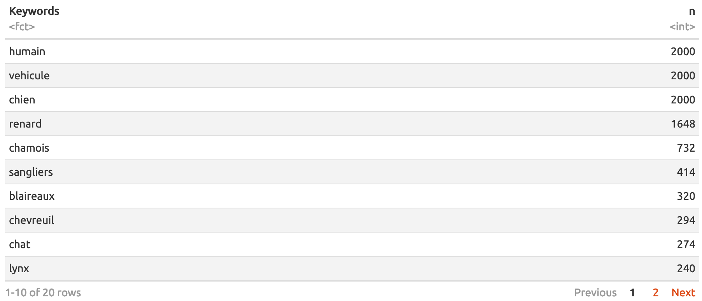
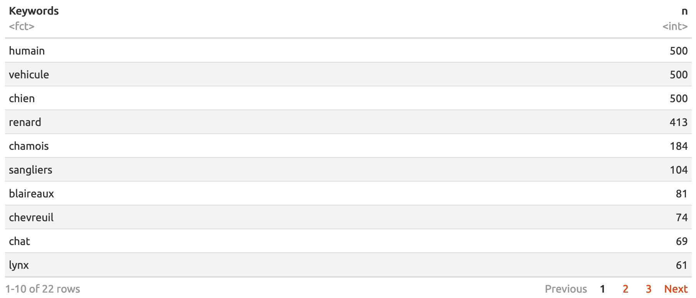
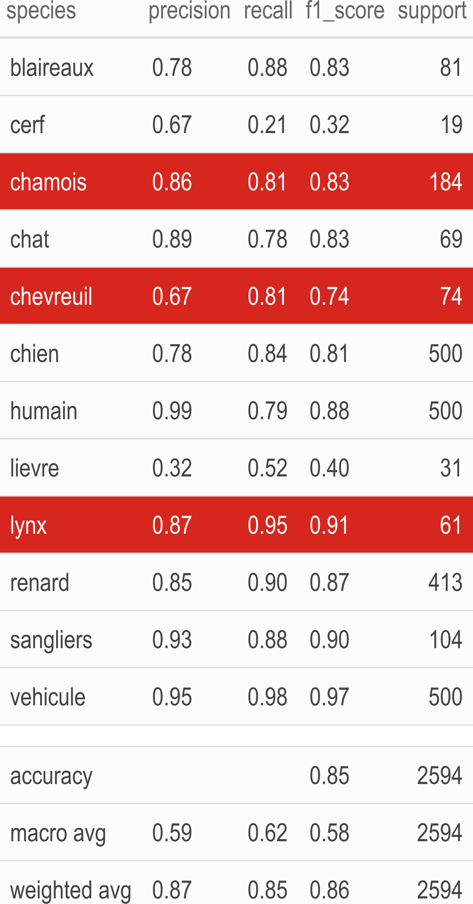

class: center, middle
background-image: url(img/illustration1bis.jpg)
background-size: cover 
<br>
### Deep learning, false negatives/positives and predator-prey interactions: Peregrinations in `R`

.large[Olivier Gimenez [`r icon::fa_twitter()`](https://twitter.com/oaggimenez) [`r icon::fa_github()`](https://github.com/oliviergimenez) | Journée IA & Biodiversité NUMEV-Cemeb [`r icon::fa("home")`](https://www.labex-cemeb.org/en/node/4374)] 

.footnote[
`r icon::fa("camera")` Alain Laurent & David Hackel]

```{r setup, include=FALSE}
options(htmltools.dir.version = FALSE)
library(tidyverse)
library(kableExtra)
```

```{r xaringan-themer, include=FALSE, warning=FALSE}
library(xaringanthemer)
style_duo(primary_color = "#1F4257", secondary_color = "#F97B64")
```

???

+ Bonjour. Mon nom est Olivier Gimenez. Je suis chercheur CNRS au Centre d'Ecologie Fonctionnelle et Evolutive à Montpellier. 

+ Je vais vous parler de mes premiers pas dans le deep learning avec le logiciel R, et l'étude des interactions entre espèces à partir de pièges photos. 


---
class: inverse, left, top
background-image: url(img/grabbytheballs.jpg)
background-size: cover 

## Predator-prey interactions

.footnote[
`r icon::fa("camera")`[Sarah Skinner](https://www.comedywildlifephoto.com/gallery/finalists/2019_finalists.php)]


???

+ Je travaille sur les relations prédateur-proies, des interactions entre espèces qui façonnent les communautés de grands mammifères. 

+ La question que l'on se pose est de comprendre comment l'environnement et les relations entre prédateurs et proies s'articulent. 


---
class: left, middle
background-image: url(img/juramountains.jpg)
background-size: cover 

<br><br><br><br><br><br><br><br><br><br>

<li>Coll. A. Chaine, M. Kervellec, V. Miele, [OFB](https://ofb.gouv.fr/) and Ain/Jura hunting associations
<li>Precious help from folks at [Montpellier Bioinformatics and Biodiversity (MBB)](https://mbb.univ-montp2.fr/MBB/index.php)

.footnote[
`r icon::fa("camera")` [Peter Bucks](https://twitter.com/peterbucks)]

???

+ Il s'agit d'un travail en collaboration avec Anna Chaine et Maëlis Kervellec, Vincent Miele, les collègues de l'Office Français de la Biodiversité et des fédérations de chasse de l'Ain et du Jura.  

+ J'en profite pour remercier les collègues de la plateforme Montpellier Bioinformatique Biodiversité qui ont été d'une aide précieuse dans l'utilisation des machines GPU.

---
class: left, top
background-image: url(img/lynx_kittens.JPG)
background-size: cover

???

+ Les collègues de l'OFB et des fédérations de chasse collectent des données dans l'habitat naturel des espèces qui nous intéressent, grâce à des pièges photos laissés à des endroits stratégiques. 

+ Précisément de chaque côté de chemins où les prédateurs sont susceptibles de passer, comme ici une femelle et ses petits.  

--

* Non-invasive monitoring

???

+ Cette méthode est non-invasive, autrement dit on n'a pas besoin de capturer physiquement les animaux.

--

* Gigas of pix to tag by hand

???

+ Le souci est qu'on se retrouve avec des tonnes de photos auxquelles il faut associer une étiquette espèce. 

--

* Deep learning?

???

+ C'est là qu'entre en jeu le deep learning.

---
class: center, middle
background-image: url(https://miro.medium.com/max/3840/1*oB3S5yHHhvougJkPXuc8og.gif)
background-size: contain 

.footnote[
Source: [Andrew Ng](https://en.wikipedia.org/wiki/Andrew_Ng)]


???

+ L'idée est de nourrir les algorithmes avec des photos en entrée pour en sortie récupérer l'espèce qui se trouve sur la photo. 


---
class: center, top
background-image: url(img/imaginecology.png)
background-size: contain 
## <https://ecostat.gitlab.io/imaginecology/>

<br><br><br><br><br><br><br><br><br><br><br><br><br>

#### Kuddos to [Vincent Miele](https://lbbe.univ-lyon1.fr/-Miele-Vincent-.html) and [Gaspard Dussert](https://www.linkedin.com/in/gaspard-dussert/?originalSubdomain=fr) !


???

+ Pour faire mes premiers pas en deep-learning, j'ai utilisé imaginecology que l'on propose avec le GDR Ecologie Statistique. 

+ C'est un site bourré de ressources, avec une intro au deep-learning en vidéo par exemple, ou encore tout un tas de tutoriels pour vous former. 

---
class: right, top
background-image: url(img/illustration1.jpg)
background-size: cover 

.footnote[
`r icon::fa("camera")` [Sylvain Gatti](https://www.linkedin.com/in/sylvaingatti/?locale=fr_FR)]

???

+ Revenons-en au lynx. 

--

I used the [Python/PyTorch fastai deep learning library](https://github.com/fastai/fastai)

???

+ Pour mes analyses, j'ai utilisé la librairie fast-ai qui repose sur le langage Python et sa librairie Pytorch. 

--

It comes with an [`R` interface](https://eagerai.github.io/fastai/) that provides `R` wrappers to fastai.

```{r, out.width="50%", echo = FALSE}
knitr::include_graphics("img/fastai.png")
```

???

+ Un avantage de cette librairie est qu'elle vient avec un package R qui propose tout un tas de fonctions pour l'utiliser. 

---
class: inverse, right, top
background-image: url(https://blog.nationalgeographic.org/wp-content/uploads/2013/08/01-Snapshot-originals-3-Slide61.gif)
background-size: cover 

## Results?


???

Quels sont les résultats que j'ai obtenus?

---
class: inverse, center, middle

## Transfer learning on a site (Jura)

???

Dans un premier temps, j'ai fait du transfer learning sur un site d'étude dans le Jura où on avait tout un tas de photos déjà étiquetées. 

---
## Some `R` code

Load the `fastai` library:
```{r eval = FALSE}
library(fastai)
```

???

+ Pour ce faire, il suffit de quelques lignes de code R. 

+ On charge le package fast-ai d'abord. 

---
## Some `R` code

Load and apply transformations on training/validation pictures:
```{r eval = FALSE}
dls <- ImageDataLoaders_from_folder(
  path = "pixdir/pix/",
  train = "train",
  valid = "valid",
  item_tfms = Resize(size = 460), # resize pix
  batch_tfms = list(aug_transforms(size = 224, 
                                   min_scale = 0.75), # flip, rotate, 
                                                      # zoom, warp, 
                                                      # light transf.
                    Normalize_from_stats( imagenet_stats() )))
```

???

+ Puis on charge les photos qu'on a séparées au préalable en un jeu de données d'entrainement et un jeu de données de validation, et on leur applique tout un tas de traitements. 

---
## Some `R` code

Get the model architecture, a resnet50:
```{r eval = FALSE}
learn <- cnn_learner(dls = dls, 
                     arch = resnet50(), 
                     metrics = list(accuracy, error_rate))
```

???

+ On récupère un modèle déjà pré-entrainé, ici un resnet50. 

---
## Some `R` code

Train using CPU or GPU:
```{r eval = FALSE}
one_cycle <- learn %>% 
  fit_one_cycle(n_epoch = 20, 
                cbs = SaveModelCallback(every_epoch = TRUE, 
                                        fname = 'model'))
one_cycle
```

???

+ Puis on fait l'entrainement sur nos données. 

+ Ici j'ai utilisé 20 epochs et sauvegardé le modèle après chaque epoch pour une utilisation ultérieure. 

---
class: center, middle
background-image: url(img/lynxplusprey.png)
background-size: contain 


???

+ Les résultats sont plutôt bons. On arrive à classifier le lynx, et ses proies, le chamoix et le chevreuil, avec un degré de certitude satisfaisant.

---
class: inverse, center, middle

## Automatic tagging in another site (Ain)


???

+ Ensuite, j'ai voulu utilisé mon modèle pour étiqueter automatiquement des photos prises avec des pièges installés sur un autre site, dans l'Ain. Ces photos ont aussi été étiquetées à la main. On connait donc la vérité.


---
## Some `R` code

Tag pictures based on the model we trained:
```{r eval = FALSE}
learn %>% 
  predict(pix_to_be_tagged)
```

???

+ Dans R, c'est avec la fonction predict qu'on étiquette une nouvelle photo grâce au modèle entrainé aux étapes précédentes. 

---
class: middle, center
background-image: url(img/blackboard.jpg)
background-size: cover 

```{r echo = FALSE, message = FALSE, warning = FALSE}
load(here::here("dat/", "pixAinannot.RData"))
library(highcharter)
dout <- unclass(table(tt_final$observed,tt_final$predicted))
perf_prediction <- hchart(dout, label = TRUE) %>%
    hc_yAxis(title = list(text = 'Actual')) %>%
    hc_xAxis(title = list(text = 'Predicted'),
             labels = list(rotation = -90)) %>%
    hc_add_theme(hc_theme_chalk())
perf_prediction
```

???

+ Les résultats peuvent être représentés sous la forme d'une matrice de confusion, avec les espèces qui sont prédites par l'algorithme en colonnes, et les espèces qui se trouvent effectivement sur les photos en lignes.  

+ On se concentre sur le lynx et on dissèque les faux positifs et faux négatifs.  

+ Un faux négatif est par exemple une photo sur laquelle on a un lynx mais on prédit une autre espèce. Un faux positif est une photo sur laquelle on n'a pas de lynx mais on prédit qu'il y en a un. 

+ On commence avec les faux négatifs, en ligne donc, on voit que le lynx est confondu avec chat et renard surtout. 

+ On continue avec les faux positifs, les colonnes donc, et on voit qu'on prédit qu'il y a un lynx sur les photos alors que ce sont en fait des chevreuils, ou des renards sur les photos.

---
class: center, middle
background-image: url(https://media.giphy.com/media/j4rPM934CLIvC/giphy.gif)
background-size: cover 

???

+ C'est pas très satisfaisant. Mais passée la frustration, on s'est posé la question, est-ce bien grave par rapport à la question écologique des interactions prédateur-proie?


---
background-color: white

```{r echo = FALSE}
knitr::include_graphics("img/rota_cover.png")
```

???

+ Pour voir si les biais sont graves, on a utilisé des modèles statistiques qui permettent d'inférer les co-occurrences entre espèces en tenant compte de la difficulté de les détecter sur le terrain - les modèles dits d'occupancy. 

---

## Some `R` code

Load `unmarked` to fit SDMs w/ interactions and imperfect detection:
```{r eval = FALSE}
load(unmarked)
```

???

+ On peut implémenter ces modèles dans R avec le package unmarked. 

---
background-color: white

<br>

```{r echo = FALSE}
knitr::include_graphics("img/species_data.png")
```

???

+ Voilà un cliché des données, avec une figure par espèce, en ligne les pièges photo et en colonne le temps. En rose ce sont les non-détections, et en turquoise les détections. 

---
## Some `R` code

Fit a model w/ interactions bw lynx, roe deer and chamois, w/ cats and fox too:
```{r eval = FALSE}
# Marginal and interaction effects
occFormulas <- c('~1','~1','~1','~1','~1','~1','~1','~0',...,'~0') 

# Detection probabilities
detFormulas <- c('~1','~1','~1','~1','~1')

# Fit occupancy model
fit <- occuMulti(detformulas = detFormulas,
                 stateformulas = occFormulas,
                 data = data,
                 method = "Nelder-Mead")
fit
```

???

+ A partir de ces données, on construit des modèles pour tester nos hypothèses sur les interactions. 

+ Ici je ne regarde que les interactions possibles entre le lynx et ses proies. 

+ On considère aussi une détection différente pour chaque espèce. 

+ Et on ajuste ce modèle par max de vrais. 


---
class: inverse, center
background-color: white

### Conditional occupancy probabilities

```{r echo = FALSE}
knitr::include_graphics("img/conditional_occ.png")
```

???

+ On obtient les probabilités de présence du lynx, conditionnellement à la présence ou absence de ses proies. 

+ En rouge, c'est l'analyse sur les photos étiquetées à la main, sans faux positifs ni faux négatifs donc. 

+ En gris-bleu, le même modèle ajusté aux photos étiquetées par notre réseau de neurones convolutif. 

+ Il y a un petit biais dans l'estimation de la probabilité de présence du lynx sachant la présence de ses deux proies favorites quand on se fie à l'étiquetage automatique des photos. 

+ Etant donné que les différences ne sont pas énormes, l'écologue pourra décider de les ignorer au regard du temps gagné par rapport à un étiquetage à la main.

+ Maintenant on a un plus gros problème avec la prob de présence du lynx sachant la présence du chevreuil et l'absence du chamois qui elle est clairement sous-estimée.

---
class: left, top
background-image: url(https://media.giphy.com/media/3o7btPCcdNniyf0ArS/giphy.gif)
background-size: cover

# Conclusions

???

+ En conclusion,

--
+ Generalisation to another site is challenging.

???

+ On a vu que l'utilisation d'un modèle entrainé sur un site pour prédire sur un autre site est délicate. 

--
+ Lack of diversity in training dataset? More pix to come.

???

+ Le problème est sûrement lié au manque de diversité dans le jeu de données d'entrainement. On va ajouter plus de photos. 

--
+ Do not lose sight of the ecological question.

???

+ Il est facile de se perdre dans les dédales du deep learning, mais il faut garder le cap de la question écologique, et on peut peut-être accepter des performances moyennes des algorithmes si on peut vivre avec le biais engendré sur les indicateurs écologiques. 

--
+ Ongoing work: Accounting for both false negatives and false positives. 

???

+ Malgré tout, on peut sûrement faire mieux, et j'explore actuellement le développement de modèles de distribution d'espèce qui prendrait à la fois en compte les interactions et les faux positifs et faux négatifs. 

---
background-color: white

### [Regards de la SFEE](https://www.sfecologie.org/regard/r95-fev-2021-miele-dray-gimenez-deep-learning/)
```{r echo = FALSE, out.width="95%"}
knitr::include_graphics("img/sfee.png")
```

???

Si vous voulez allez plus loin avec le deep learning et l'analyse d'image, n'hésitez pas à jeter un coup au regard que nous avons proposé à la SFEE avec Vincent Miele et Stéphane Dray. 


---
class: center, bottom
background-image: url(img/predictions.jpg)
background-size: cover 

.footnote[
Thank you!
]


???

Merci pour votre écoute. 


---
class: center middle

# Bonus slides


---

### training dataset



---

### validation dataset



---
class: center, middle
background-color: white


```{r echo=FALSE, message=FALSE, warning=FALSE}
options(knitr.kable.NA = '')
readr::read_csv2(here::here("dat","perf_fastai.csv")) %>% 
  janitor::clean_names() %>%
  kbl() %>%
  kable_paper() %>%
  kable_styling(full_width = F, font_size = 20) %>%
  row_spec(13, bold = T, color = "white", background = "white") %>%
  row_spec(14:16, bold = T) %>%
  column_spec(1, bold = TRUE) %>%
  save_kable(here::here("img", "perf1.png"),
             zoom = 5)
```

<!-- {width=80%, height=80%} -->


???

Four metrics are given.

+ Precision is the ratio tp / (tp + fp) where tp is the number of true positives and fp the number of false positives. It quantifies the ability of the classifier not to label as positive a sample that is negative. The question that this metric answers is of all pix that labeled as positive, how many actually were positive?

+ The recall is the ratio tp / (tp + fn) where tp is the number of true positives and fn the number of false negatives. The recall is intuitively the ability of the classifier to find all the positive samples. The question recall answers is: of all the pix that were positive, how many did we label?

+ The f1-score can be interpreted as a weighted average of the precision and recall, it reaches its best value at 1 and worst score at 0. The f1-score weights recall more than precision by a factor of 1, meaning that recall and precision are equally important. f1-score is 2 * (recall * precision) / (recall + precision)

+ The support is the number of occurrences of each class in y_true (ground truth or correct target values).


---
class: center, middle
background-color: white


```{r echo=FALSE, message=FALSE, warning=FALSE}
options(knitr.kable.NA = '')
readr::read_csv2(here::here("dat","perf_fastai.csv")) %>% 
  janitor::clean_names() %>%
  kbl() %>%
  kable_paper() %>%
  kable_styling(full_width = F, font_size = 20) %>%
  row_spec(13:16, bold = T, color = "white", background = "#D7261E") %>%
  row_spec(13, bold = T, color = "white", background = "white") %>%
  row_spec(14:16, bold = T) %>%
  column_spec(1, bold = TRUE) %>%
  save_kable(here::here("img", "perf2.png"),
             zoom = 5)
```

<!-- {width=80%, height=80%} -->


???

+ macro avg: Calculate metrics for each label, and find their unweighted mean. This does not take label imbalance into account.

+ weighted avg: Calculate metrics for each label, and find their average weighted by support (the number of true instances for each label). This alters ‘macro’ to account for label imbalance.

+ Accuracy is the most intuitive performance measure and it is simply a ratio of correctly predicted observation to the total observations, it is (tp + tn)/(tp + tn + fp + fn)


---
class: center, middle
background-color: white


```{r echo=FALSE, message=FALSE, warning=FALSE}
options(knitr.kable.NA = '')
readr::read_csv2(here::here("dat","perf_fastai.csv")) %>% 
  janitor::clean_names() %>%
  kbl() %>%
  kable_paper() %>%
  kable_styling(full_width = F, font_size = 20) %>%
  row_spec(c(3,5,9), bold = T, color = "white", background = "#D7261E") %>%
  row_spec(13, bold = T, color = "white", background = "white") %>%
  row_spec(14:16, bold = T) %>%
  column_spec(1, bold = TRUE) %>%
  save_kable(here::here("img", "perf.png"),
             zoom = 5)
```

<!-- {width=80%, height=80%} -->


???

Pour les 3 espèces d'intérêt. 


---
class: inverse, center
background-color: white
### Marginal occupancy

```{r echo = FALSE, out.width = "85%"}
knitr::include_graphics("img/marginal_occ.png")
```

???

+ On obtient les probabilités de présence de chaque espèce, lynx, chevreuil et chamois. 

+ En rouge, c'est l'analyse sur les photos étiquetées à la main, sans faux positifs ou négatifs donc. 

+ En gris-bleu, le même modèle ajusté aux photos étiquetées par notre réseau de neurones convolutif. 

+ Il y a clairement des biais dans l'estimation des probabilités de présence quand on se fie à l'étiquetage automatique des photos, mais étant donné que les différences ne sont pas énormes, l'écologue pourrait décider de les ignorer au regard du temps gagné par rapport à un étiquetage à la main.


---
class: center, top
background-image: url(img/imagine_conf.png)
background-size: cover

<br><br><br>

### <https://imaginecology.sciencesconf.org/>


???

+ Toujours avec le GDR EcoStat, nous avons organisé en novembre des rencontres autour de l'utilisation des méthodes d'apprentissage profond pour l'analyse d'images et de sons en écologie.

+ A cette occasion, Vincent Miele a donné un exposé introductif filmé dans lequel il explique les concepts généraux, les réseaux de neurones et le vocabulaire technique. 


